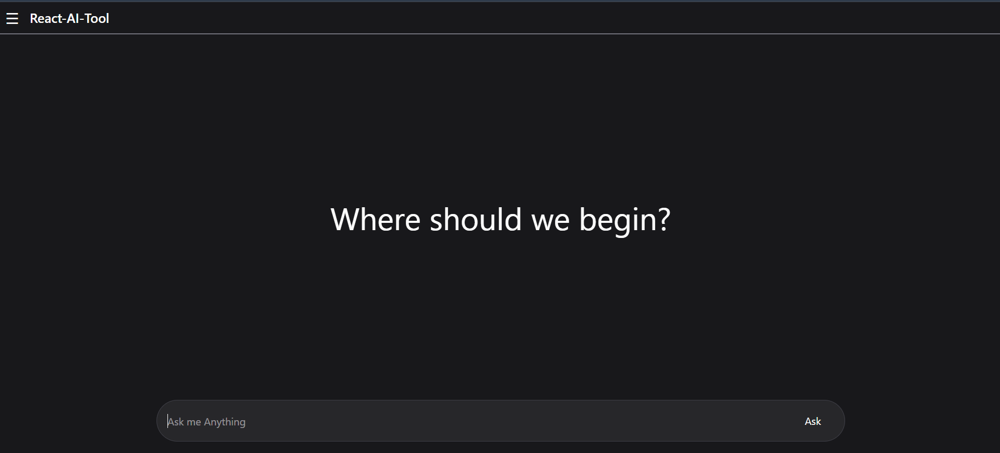
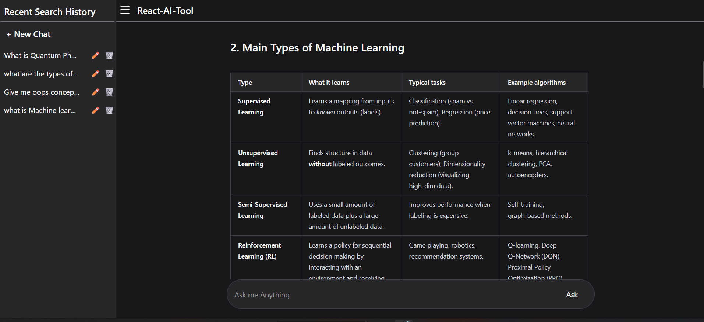
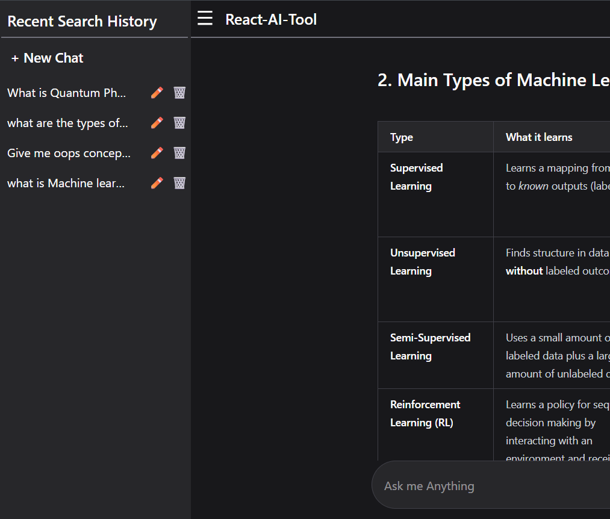

🚀 React AI Tool
    An AI-powered chat application built using React.js and Groq API that supports real-time conversations, markdown rendering, syntax-highlighted code blocks, persistent chat history, and a fully responsive modern UI.

🌐 Live Demo
    🔗 [Live Website](https://react-ai-tool-using-groq-api.vercel.app/)

✨ Features
    - 🤖 AI-powered chat interface
    - 💬 Persistent chat history using localStorage
    - 📝 Markdown rendering support
    - 🎨 Syntax-highlighted code blocks
    - ⚡ Real-time AI responses using Groq API
    - 📱 Fully responsive design
    - 🔄 Auto-scroll chat behavior
    - ⌨️ Keyboard interaction support
    - 📂 Sidebar-based chat management
    - ❌ Error handling and loading states
    - ♻️ Reusable React components
    - 🪝 Custom React hooks for cleaner state management

🛠️ Tech Stack
     Technology                | Usage                     
     React.js                  | Frontend UI               
     JavaScript                | Application Logic         
     Tailwind CSS              | Styling                   
     Vite                      | Build Tool                
     Groq API                  | AI Response Generation    
     React Markdown            | Markdown Rendering        
     React Syntax Highlighter  | Code Highlighting         

📸 Screenshots

    🏠 Home Screen
        

    🤖 AI Response Rendering
        

    📂 Sidebar Chat History
        

📁 Folder Structure

    src
    ├── components
    │   ├── Answers.jsx
    │   ├── ChatArea.jsx
    │   ├── ChatInput.jsx
    │   ├── Header.jsx
    │   ├── Loader.jsx
    │   ├── MessageBubble.jsx
    │   ├── NewChat.jsx
    │   └── Sidebar.jsx
    │
    ├── hooks
    │   └── useChat.js
    │
    ├── services
    │   └── groqApi.js
    │
    ├── App.jsx
    └── main.jsx

⚙️ Environment Variables
    Create a .env file in the root directory and add the following:
    VITE_GROQ_API_KEY=your_api_key_here

📦 Installation & Setup
    1️⃣ Clone the repository
        git clone https://github.com/harsha21042/React-Ai-Tool-using-GroqAPI.git

    2️⃣ Navigate to the project folder
        cd react-ai-tool

    3️⃣ Install dependencies
        npm install

    4️⃣ Start the development server
        npm run dev

🚀 Deployment
    The application is deployed on Vercel with secure environment variable configuration.

🧠 Key Learnings
    React component architecture
    Custom hooks
    API integration
    Markdown rendering
    Syntax highlighting
    State management
    Responsive UI development
    Error handling
    LocalStorage persistence
    Project deployment using Vercel
    Vercel

📌 Future Improvements
    Streaming AI responses
    Authentication system
    Theme switcher
    Copy-to-clipboard support
    Export chat feature

👨‍💻 Author
    Developed by Harshal Aher using React.js and modern frontend development practices.

⭐ If you like this project
    Give it a star on GitHub ⭐

